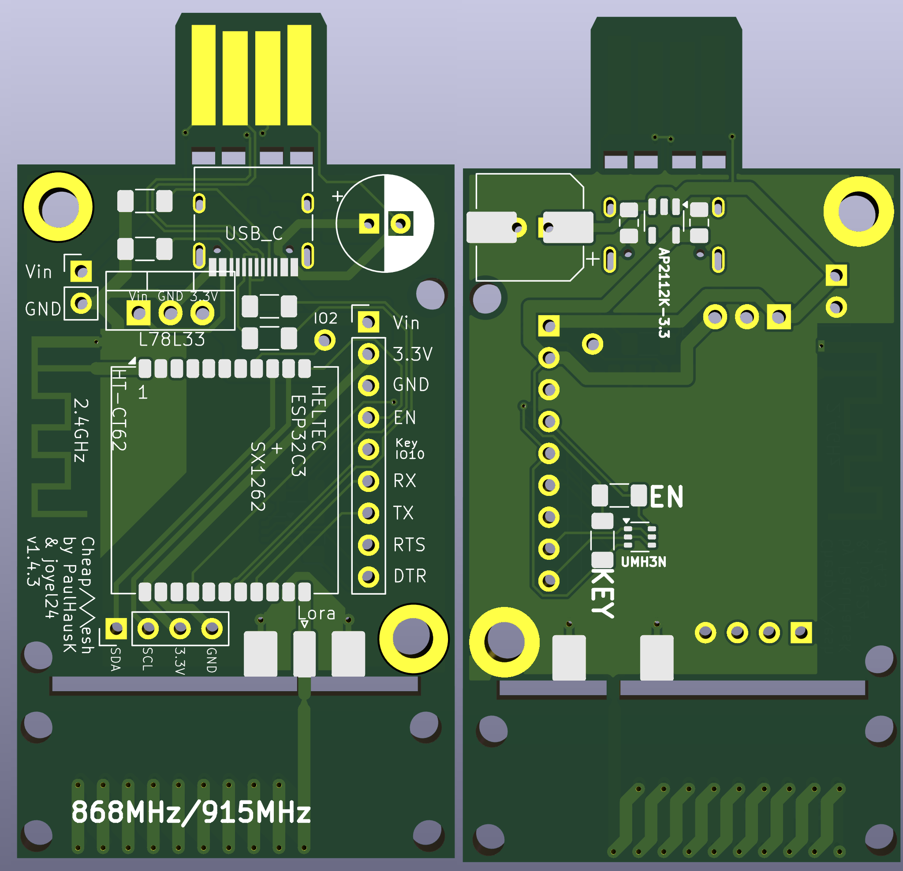
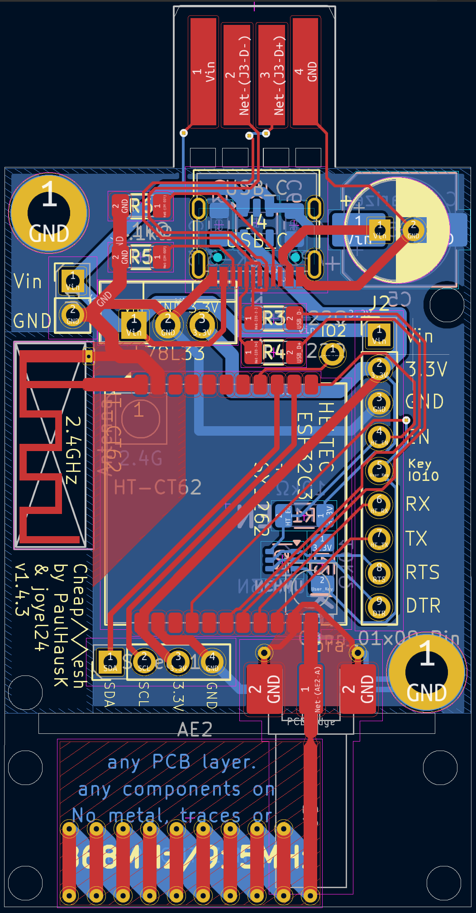

# CheapMesh

CheapMesh is a pcb arround the HT-CT62 chip by Heltec.

The goal is to get a cheap Meshtastic node with this chip, therefore some corners where cut.

Several componemts are implemented double, just pick what works best for you.

## PCB

## BOM
WIP

### Antenna 
* Option A: use the onboard antennas
* Option B: use an external antenna with the IPEX connector (and cutting of the onboard lora antenna)
* Option C: use an external antenna with an sma connector (and cutting of the onboard lora antenna)
* Option D: solder on a dipol antenna (and cutting of the onboard lora antenna)
  
### Screen
* Completele optional. Make sure to get a screen with the matching pinout.

### 3.3V Regulator
* Option A: use an external 3.3V powersource
* Option C: use a AP211K-3.3 and the correspondending capacitors
* Option B: use a L78L33 and the correspondending capacitors
* Option D: use a [L78L33 pin compatible DC/DC Buck converter like this one](https://aliexpress.com/item/1005005626634245.html?spm=a2g0o.productlist.main.1.1897OyxROyxRry&algo_pvid=5153460b-3c1f-4c8b-b6be-ddba46f5bff5&algo_exp_id=5153460b-3c1f-4c8b-b6be-ddba46f5bff5-0&pdp_npi=4%40dis%21EUR%211.55%210.95%21%21%211.62%210.99%21%402103853617143919371401715e9ea6%2112000033795813043%21sea%21DE%210%21AB&curPageLogUid=g6keG6AFecrJ&utparam-url=scene%3Asearch%7Cquery_from%3A)
  
### Resetting for flashing
* Option A: populate the UMH3N
* Option B: use an external usb serial interface which can reset the chip
* Option C: Connect GND and HT_EN with a wire. Power on the board (by plugging in) and remove the wire.

### Powering the Board
Never connect more than one powersource at a time!!!
* via the usb a pcb connector
* via the usb c connector 
* via the Vin Pins
* via the 3.3V Pins
  

### Resistors
All Resitors are 1206 SMD Resistors

R1, R2: Pullup Resistors, 10kOhm

R3, R4: USB Inline Resistors, 22Ohm

R5, R6: USB-C Resistors, 5,1kOhm

If you want to flash and reflash the HT-CT62 on the pcb, you need to populate R1 and R2.
If you not wanna flash the HT-CT62 on the pcb (you have a already programmed chip), you can make a solder bridge on R1.

## Building instructions
WIP
1. Source the the pcb yourself. I recomend JLCPCB (I not payed nor sponsored by them) to get the pcb created. 5 pcbs should cost 2$ plus shipping and taxes.
2. Solder on the components.
3. Flash the ESP.
    * Option A -  use an external usb serial interface
    * Option B - use the usb A pcb port
    * Option C - use the usb c port

 ## License
 
CheapMesh by PaulHausK is licensed under <a href="https://creativecommons.org/licenses/by-sa/4.0/?ref=chooser-v1" target="_blank" rel="license noopener noreferrer" style="display:inline-block;">Creative Commons Attribution-ShareAlike 4.0 International</a>

